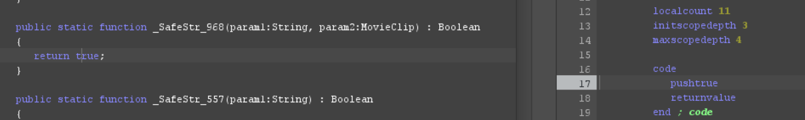
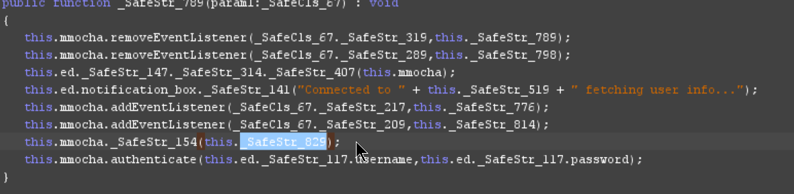
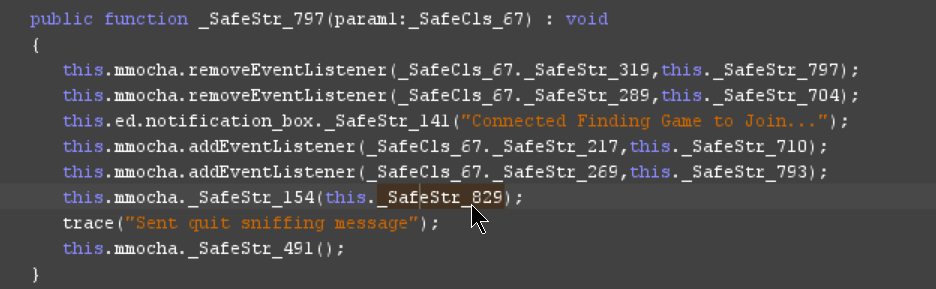
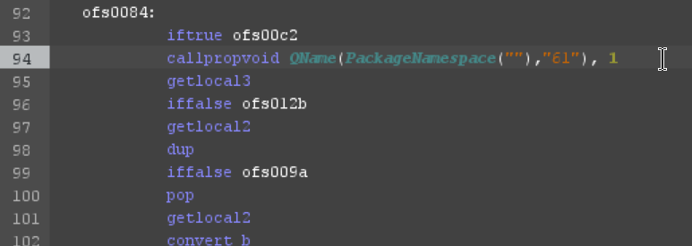
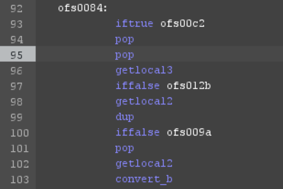
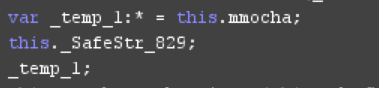

# Blast Rage Online

A server emulator for the MMO game Blast Rage Online.

🎯 The goal of this project is to preserve the MMO game Blast Rage Online (version public6b) from XGen Studios.

⚠️ Currently not yet ready and still in development.


# Requirements and installation

📝 Requires Node ^24 and MySQL ^9.

1. Download the repo and unzip it
2. Gather the game files and drop them in **src/public**
3. Edit the settings.ini servers array and point it towards your own server
4. Configure **config/app.env** and **config/knexfile.js** to your needs
5. Create a new database in your MySQL server called **bro**
6. Open terminal, cd to the unzipped directory, and install all modules using `npm i`
7. In the same terminal, run the command `npm run migrate`, `npm run seed` and `npm run start`*

❓ *A single instance of the game server alongside a web server will start up.

# Playing the game

Because support for Adobe Flash has ceased, your only options are to create an Electron client, or use Pale Moon. The latter is the easiest.

1. Download Pale Moon [here](https://www.palemoon.org/download.php?mirror=eu&bits=64&type=7z)
2. Extract it and create a new directory inside `palemoon-34.3.2.win64\palemoon` called **plugins**
3. Download `NPSWF64_32_0_0_371.dll` from [here](https://github.com/dreamcentury/webbrowser-flash) and place it in the plugins folder
4. In Pale Moon, go to `about:config` and set `plugins.load_appdir_plugins` to **true**
5. Flash should now be activated in `about:plugins`

⚠️ Due to copyright, I won't be able to include the game files. They're easy to find on Archive.org.

# Reverse engineered caveats

📝 P-code changes requires JPEXS ^26.

### Remove domain lock

The game is domain locked, a classic DRM in Flash games. In the main class of the game, it'll check the domain.
> if(_SafeCls_10._SafeStr_968("xgenstudios.com",this) || _SafeCls_10._SafeStr_968("blastrage.com",this))


You can easily patch out this check by always returning true in the function `public static function _SafeStr_968(param1:String, param2:MovieClip) : Boolean`.


Select the function name, click the button to edit the P-code and modify the **code** block to only this:

```
code
   pushtrue
   returnvalue
```



### API

The game makes several API calls to XGen Studios. Our web server has to support these. Make sure to edit every `http://api.xgenstudios.com` to `http://YOUR-IP/`.

### Funky server settings

There appears to be some sort of bug going on when it comes to having a predefined server by default. The game does retrieve all servers but just never sets them. Instead it'll use **dev.mmocha.com** which is already set on `_SafeStr_519`. I suppose you're better off changing this variable to your IP. I just ignored this and went over it quickly, I could be wrong. There's also a secret event when holding CTRL and clicking **Got a Gamepad? Get Joy2Key** that you can trigger that'll change the port to 1139.

### Sniffing packet

The developers made a silly obfuscation where the client will include **0bquitsniffing** before quick play and the login packet. This is meant to hide packets and get in your way. This string is defined in variable `_SafeStr_829`.

First find where it's used before sending login:



And where it's used before quick play:



Select the function name, click the button to edit the P-code, find `callpropvoid QName(PackageNamespace(""),"61"), 1`.



Replace it with `pop` and add another entry `pop`.



This results in the call being disabled.



You'll have to do that for both of the functions.

### Custom Caesar shift cipher

A custom Caesar cipher is being used to obfuscate packets that don't start with **0**. When a packet is sent, it'll randomly choose a shift value between 0 and 59. Every character in the packet is shifted forward through the alphabet by that amount. The shift value is then encoded as a single character and prepended to the packet. The server reads this first character to determine the shift amount, removes it, and shifts the remaining characters backwards to recover the original packet.

# License & Copyright

This project applies the BSD-3-Clause license. This project aims to preserve this game. I'm not entitled in any sort of way on claiming copyright on it. All of the credit goes to Robyn Dubuc & XGen Studios. I'm not affiliated with them.