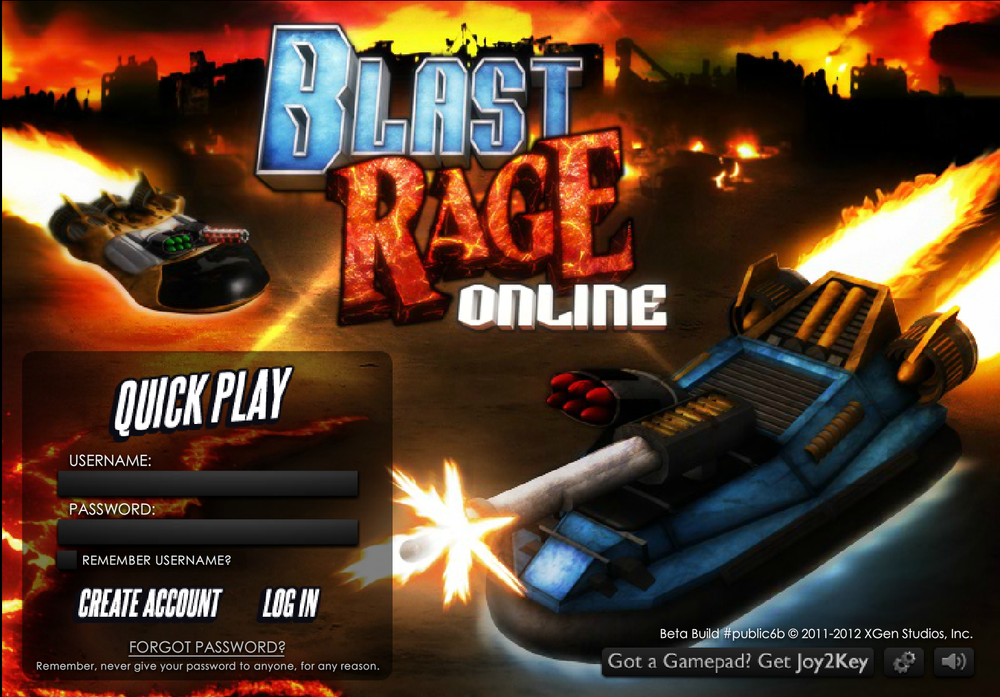
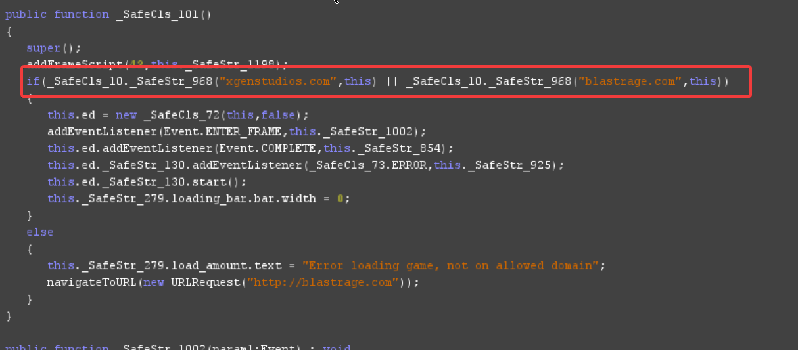
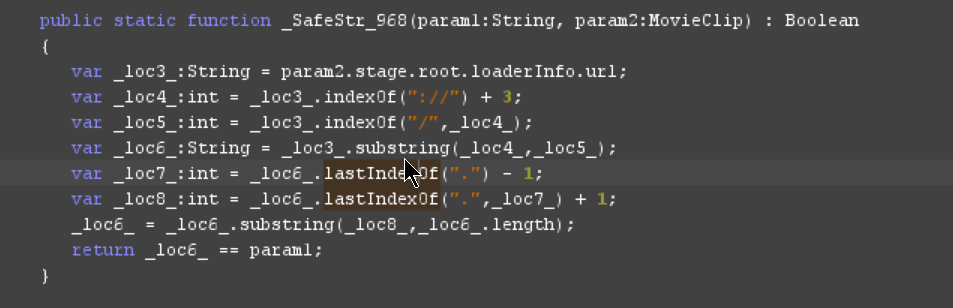

# Blast Rage Online

A server emulator for the MMO game Blast Rage Online.

🎯 The goal of this project is to preserve the MMO game Blast Rage Online (public6b) from XGen Studios.



# Requirements and installation

📝 Requires Node ^24 and PostgreSQL ^18.

1. Download the repo and unzip it
2. Open terminal, cd to the unzipped directory, and install all modules using `npm i`
3. In the same terminal, run the command `npm run start`

# Required P-code changes to the SWF

📝 Requires JPEXS ^26.

The game is domain locked, a classic "DRM" in Flash games. In the main class of the game, it'll check the domain.
> if(_SafeCls_10._SafeStr_968("xgenstudios.com",this) || _SafeCls_10._SafeStr_968("blastrage.com",this))



You can easily patch out this check by always returning true in the function `public static function _SafeStr_968(param1:String, param2:MovieClip) : Boolean`.



Select the function name, click the button to edit the P-code and modify the **code** block to only this:

```
code
   pushtrue
   returnvalue
```


# Playing the game

Because Adobe Flash support has ceased, your only option is to create an Electron client, or use Pale Moon. The latter is the easiest.

1. Download Pale Moon [here](https://www.palemoon.org/download.php?mirror=eu&bits=64&type=7z)
2. Extract it and create a new directory inside `palemoon-34.3.2.win64\palemoon` called **plugins**
3. Download `NPSWF64_32_0_0_371.dll` from [here](https://github.com/dreamcentury/webbrowser-flash) and place it in the plugins folder
4. In Pale Moon, go to `about:config` and set `plugins.load_appdir_plugins` to **true**
5. Flash should now be activated in `about:plugins`

⚠️ Due to copyright, I won't be able to include the game files.

# License & Copyright

This project applies the BSD-3-Clause license. This project aims to preserve this game. I'm not entitled in any sort of way on claiming copyright on it. All of the credit goes to Robyn Dubuc & XGen Studios. I'm not affiliated with them.